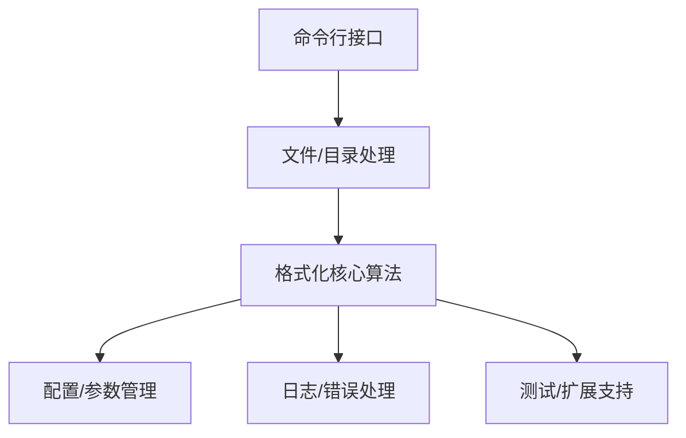
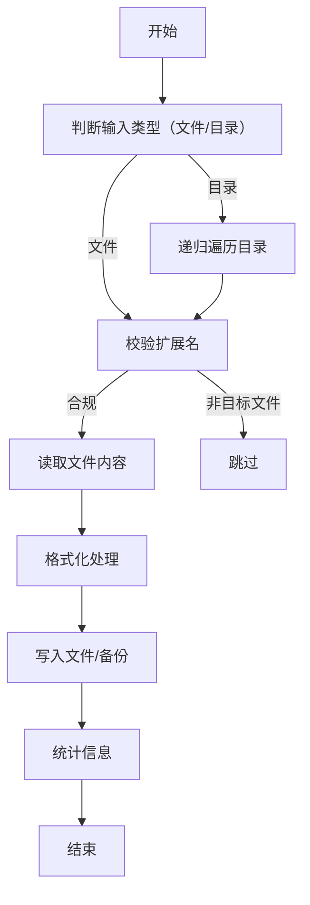
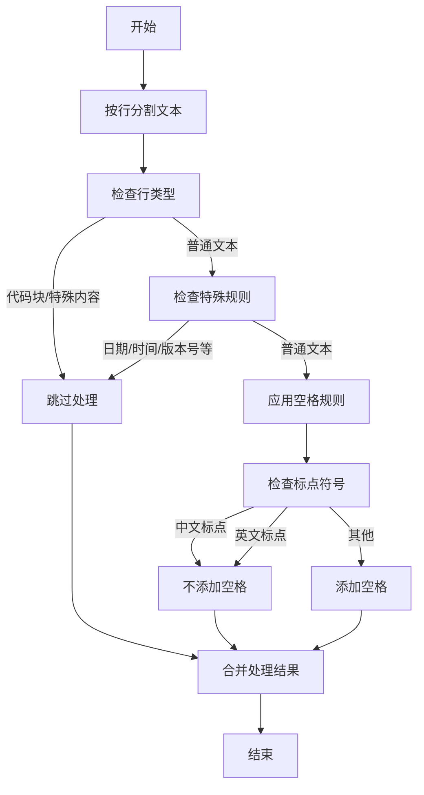
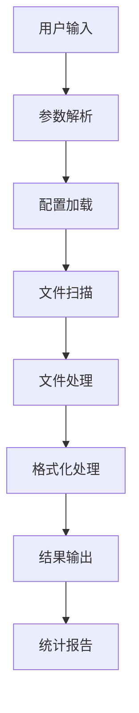
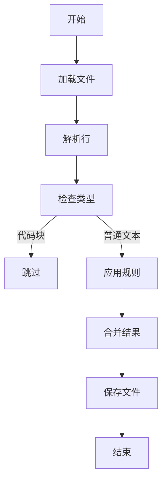
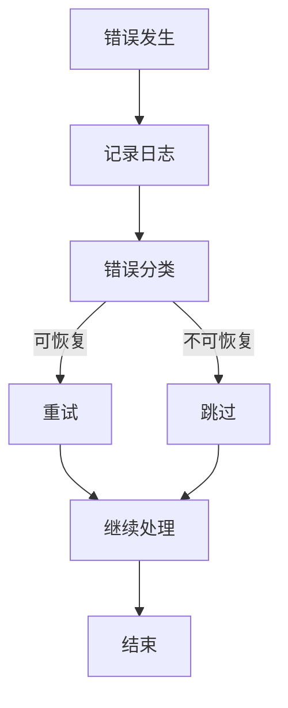

---
**文档标题**：markdown-spacer 技术设计文档
**文档版本**：v1.0
**创建时间**：2025-07-22
**更新时间**：2025-07-22
**维护人员**：刘凡 & 小克
**文档状态**：进行中
---

# markdown-spacer 技术设计文档

## 1. 设计目标

- **聚焦核心需求**：专注于 Markdown 文档中英文、数字间空格的自动处理，提升文档可读性和规范性。
- **高可用性与易用性**：提供简单易用的命令行工具，支持单文件和批量处理，参数灵活。
- **可扩展性**：支持规则扩展和自定义，便于后续功能迭代。
- **高代码质量**：代码规范、易维护，具备完善的测试和错误处理能力。

## 2. 总体架构

markdown-spacer 采用分层解耦设计，核心架构包括：

- **命令行接口层**：负责参数解析、用户交互和入口调度。
- **文件与目录处理层**：负责 Markdown 文件的识别、读取、写入和批量遍历。
- **格式化核心算法层**：实现中英文、数字间空格的自动处理逻辑。
- **配置与参数管理层**：统一管理运行参数、规则配置和扩展点。
- **日志与错误处理层**：负责日志记录、异常捕获和用户友好提示。
- **测试与扩展支持层**：支持单元测试、规则扩展和性能评估。



> 📝 后续将逐步细化各核心模块设计与关键技术方案。

## 3. 核心模块划分

### 3.1 命令行接口模块

#### 设计目标

- 提供简洁直观的命令行入口，降低用户使用门槛
- 参数命名短小，避免冗长和复杂
- 支持单文件和目录批量处理，常用功能一键可达

#### 主要参数设计

| 参数         | 简写 | 说明                   | 是否必选 |
| ------------ | ---- | ---------------------- | -------- |
| input        | -i   | 输入文件或目录路径     | 是       |
| silent       | -s   | 静默模式（无输出）      | 否       |
| recursive    | -r   | 递归处理目录           | 否       |
| backup       | -b   | 处理前备份原文件        | 否       |
| help         | -h   | 显示帮助信息            | 否       |

#### 使用示例

```bash
# 处理单个文件
python markdown_spacer.py -i doc.md

# 递归处理目录
python markdown_spacer.py -i docs/ -r

# 静默模式
python markdown_spacer.py -i doc.md -s

# 备份原文件
python markdown_spacer.py -i doc.md -b
```

#### 参数解析说明

- 推荐使用 argparse 或 click 等主流库实现参数解析
- 参数顺序不强制，支持短参数（如 -r）和长参数（如 --recursive）
- 保持参数数量精简，避免用户记忆负担

> 提示：后续将细化文件与目录处理模块设计。

### 3.2 文件与目录处理模块

#### 设计目标

- 高效识别和处理 Markdown 文件，支持单文件和目录批量操作
- 递归遍历目录，灵活过滤目标文件类型
- 保证文件读写安全，异常处理健全
- 便于后续扩展更多文件类型或处理策略

#### 主要功能

- 识别 `.md`、`.markdown` 文件，忽略其他类型
- 支持递归遍历目录，批量收集所有目标文件
- 文件读取与写入，支持原地修改和备份
- 处理文件读写异常，输出友好错误信息
- 统计处理文件数量、失败数等信息

#### 处理流程



#### 关键实现要点

- 推荐使用 `pathlib` 统一路径处理，兼容多平台
- 递归遍历用 `os.walk` 或 `pathlib.Path.rglob`
- 文件读写建议使用 UTF-8 编码，异常时输出文件名和错误详情
- 备份模式下，先复制原文件再写入
- 统计信息可用于后续输出和性能评估

> 📝 下一步将细化格式化核心算法模块设计。

### 3.3 空格处理与格式化核心算法

#### 设计目标

- 基于正则表达式实现高效的中英文、数字间空格处理
- 保证处理准确性，避免误修改代码块、链接等特殊内容
- 支持规则扩展和自定义，便于后续功能迭代
- 性能优化，支持大文件快速处理

#### 核心处理规则

| 规则类型 | 正则表达式 | 处理方式 | 示例 |
| -------- | ---------- | -------- | ---- |
| 中英文间 | `([一-龯])([a-zA-Z])` | 添加空格 | `中文English` → `中文 English` |
| 英中文间 | `([a-zA-Z])([一-龯])` | 添加空格 | `English中文` → `English 中文` |
| 中数字间 | `([一-龯])(\d)` | 添加空格 | `中文123` → `中文 123` |
| 数字中间 | `(\d)([一-龯])` | 添加空格 | `123中文` → `123 中文` |
| 数学符号连接 | `([\u4e00-\u9fa5a-zA-Z0-9])([+\-/*=<>])([\u4e00-\u9fa5a-zA-Z0-9])` | 添加空格 | `A+B` → `A + B`，`张三-李四-王五` → `张三 - 李四 - 王五`，`草稿/进行中/已完成/归档` → `草稿 / 进行中 / 已完成 / 归档` |
| 日期处理 | `\d{4}-\d{1,2}-\d{1,2}`\|`\d{1,2}-\d{1,2}`\|`\d{1,2}月\d{1,2}[日号]?`\|`\d{4}年\d{1,2}月\d{1,2}[日号]?` | 不添加空格 | `2025-07-20`、`7-20`、`7月20日`、`2025年7月20日`、`2025年7月20号` |
| 中文双引号 | `“(.+?)”` | 可选加粗 | `“重要内容”` → `**重要内容**`（可配置） |
| 中文版本号 | `v\d+\.\d+\.\d+` | 不添加空格 | `v1.2.3` → `v1.2.3` |
| 中文括号 | `（[a-zA-Z]+）`\|`[a-zA-Z]+（[\u4e00-\u9fa5]+）` | 不添加空格 | `这是（English）`、`English（这是英文）` |
| 英文连字符 | `([a-zA-Z]+)-([a-zA-Z]+)` | 不添加空格 | `Todo-List` → `Todo-List` |
| 中文连字符 | `([\u4e00-\u9fa5]+)-([\u4e00-\u9fa5]+)` | 添加空格 | `张三-李四` → `张三 - 李四` |

#### 特殊内容保护

- **代码块**：使用 ```` ``` ` 标记的内容不处理
- **行内代码**：使用 `` ` `` 标记的内容不处理  
- **链接**：`[text](url)` 格式的链接内容不处理
- **图片**：`` 格式的图片内容不处理
- **HTML 标签**：`<tag>` 内容不处理
- **数学公式**：`$...$` 或 `$$...$$` 标记的内容不处理
- **表格、列表、标题、引用块等结构内内容也会自动进行中英文空格处理，不会整体跳过**

#### 特殊规则说明

- 英文单词间的连字符（如 `Todo-List`、`e-mail`）不加空格
- 中文词语间的连字符（如 `张三-李四`）需加空格，变为 `张三 - 李四`
- 若用户希望避免工具自动处理，可用反引号（`）包裹该内容，工具将跳过处理

#### 算法流程



#### 性能优化策略

- 使用编译后的正则表达式对象，避免重复编译
- 按行处理，减少内存占用
- 缓存常用正则表达式，提升处理速度
- 支持增量处理，避免重复检查

#### 可扩展性设计

- 规则配置化，支持自定义正则表达式
- 插件式架构，便于添加新的处理规则
- 支持规则优先级和冲突处理
- 提供规则测试和验证机制

> 📝 下一步将细化配置与参数管理模块设计。

### 3.4 配置与参数管理

#### 设计目标

- 统一管理命令行参数和运行时配置
- 支持配置文件的灵活扩展
- 提供规则自定义和扩展点
- 确保配置的一致性和可维护性

#### 主要参数设计

| 参数 | 简写 | 说明 | 默认值 | 是否必选 |
| ---- | ---- | ---- | ------ | -------- |
| input | -i | 输入文件或目录路径 | - | 是 |
| silent | -s | 静默模式（无输出） | false | 否 |
| recursive | -r | 递归处理目录 | false | 否 |
| backup | -b | 处理前备份原文件 | false | 否 |
| bold-quotes | -q | 中文双引号内容加粗 | false | 否 |
| version | -v | 显示版本信息 | - | 否 |
| help | -h | 显示帮助信息 | - | 否 |

#### 配置项管理

- **运行时配置**：通过命令行参数传递，优先级最高
- **配置文件**：支持 `.markdown-spacer.json` 配置文件，优先级中等
- **默认配置**：内置默认值，优先级最低

#### 扩展点设计

- **规则配置**：支持自定义正则表达式规则
- **处理策略**：支持自定义空格处理策略
- **输出格式**：支持自定义输出格式和统计信息
- **插件机制**：预留插件接口，支持第三方扩展

#### 配置验证

- 参数类型和范围验证
- 文件路径有效性检查
- 配置项冲突检测
- 用户友好的错误提示

> 📝 下一步将细化日志与错误处理模块设计。

### 3.5 日志与错误处理

#### 设计目标

- 提供清晰的错误信息和用户友好的提示
- 支持不同级别的日志输出
- 确保程序稳定性和可调试性
- 便于问题定位和性能分析

#### 日志级别设计

| 级别 | 说明 | 使用场景 | 输出方式 |
| ---- | ---- | -------- | -------- |
| ERROR | 错误信息 | 文件读取失败、参数错误等 | 标准错误输出 |
| WARN | 警告信息 | 文件跳过、规则冲突等 | 标准输出 |
| INFO | 一般信息 | 处理进度、统计信息等 | 标准输出 |
| DEBUG | 调试信息 | 详细处理过程、正则匹配等 | 调试模式输出 |

#### 错误处理策略

##### 文件处理错误

- **文件不存在**：提示文件路径，建议检查路径
- **权限不足**：提示权限问题，建议使用 sudo 或修改权限
- **编码错误**：提示编码格式，建议转换为 UTF-8
- **磁盘空间不足**：提示空间问题，建议清理磁盘

##### 参数错误

- **参数缺失**：提示必需参数，显示使用示例
- **参数格式错误**：提示正确格式，提供示例
- **参数冲突**：提示冲突参数，建议调整

##### 处理错误

- **正则表达式错误**：记录错误位置，跳过该规则
- **内存不足**：提示文件过大，建议分批处理
- **超时错误**：提示处理超时，建议检查文件内容

#### 用户友好提示

##### 成功提示

```bash
✅ 处理完成：共处理 5 个文件，成功 5 个，失败 0 个
📊 统计信息：添加空格 23 处，删除空格 5 处
⏱️ 耗时：1.2 秒
```

##### 错误提示

```bash
❌ 错误：文件 "docs/test.md" 不存在
💡 建议：请检查文件路径是否正确
```

##### 警告提示

```bash
⚠️ 警告：跳过非 Markdown 文件 "docs/image.png"
📝 提示：只处理 .md 和 .markdown 文件
```

#### 调试支持

- **详细日志**：`--verbose` 参数启用详细日志
- **调试模式**：`--debug` 参数启用调试信息
- **日志文件**：支持将日志输出到文件
- **性能分析**：记录处理时间和内存使用

> 📝 下一步将细化测试与扩展支持模块设计。

### 3.6 测试与扩展支持

#### 设计目标

- 建立完整的测试体系，确保代码质量和功能正确性
- 支持规则扩展和自定义，便于功能迭代
- 提供性能测试和基准测试，确保处理效率
- 支持插件机制，便于第三方扩展

#### 测试体系设计

##### 单元测试

- **核心算法测试**：测试每个正则表达式规则的准确性
- **边界条件测试**：测试特殊字符、空字符串、超长文本等
- **错误处理测试**：测试各种异常情况的处理
- **配置测试**：测试不同配置参数的正确性

##### 集成测试

- **文件处理测试**：测试文件读写、目录遍历等功能
- **命令行接口测试**：测试参数解析、错误提示等
- **端到端测试**：测试完整的处理流程
- **性能测试**：测试大文件、批量处理的性能

##### 测试用例示例

```python
# 核心算法测试
def test_chinese_english_spacing():
    input_text = "中文English"
    expected = "中文 English"
    result = process_spacing(input_text)
    assert result == expected

# 边界条件测试
def test_empty_string():
    input_text = ""
    expected = ""
    result = process_spacing(input_text)
    assert result == expected

# 特殊内容保护测试
def test_code_block_protection():
    input_text = "```\n中文English\n```"
    expected = "```\n中文English\n```"
    result = process_spacing(input_text)
    assert result == expected
```

#### 规则扩展机制

##### 规则配置接口

```python
class SpacingRule:
    def __init__(self, pattern, replacement, priority=0):
        self.pattern = pattern
        self.replacement = replacement
        self.priority = priority
    
    def apply(self, text):
        # 应用规则逻辑
        pass
```

##### 自定义规则示例

```python
# 用户自定义规则
custom_rules = [
    SpacingRule(r'(\d+)%', r'\1 %', priority=1),  # 数字百分比
    SpacingRule(r'([A-Z]{2,})', r' \1 ', priority=2),  # 大写缩写
]
```

#### 性能优化支持

##### 基准测试

- **处理速度测试**：测试不同大小文件的处理速度
- **内存使用测试**：监控内存占用情况
- **并发处理测试**：测试多文件并发处理性能
- **规则优化测试**：测试不同规则组合的性能影响

##### 性能指标

- **处理速度**：文件 / 秒，字符 / 秒
- **内存使用**：峰值内存，平均内存
- **CPU 使用率**：处理过程中的 CPU 占用
- **响应时间**：单文件处理时间

#### 扩展点设计

##### 插件接口

```python
class MarkdownSpacerPlugin:
    def pre_process(self, text):
        """预处理钩子"""
        return text
    
    def post_process(self, text):
        """后处理钩子"""
        return text
    
    def custom_rules(self):
        """自定义规则"""
        return []
```

##### 扩展示例

```python
class CustomPlugin(MarkdownSpacerPlugin):
    def custom_rules(self):
        return [
            SpacingRule(r'(\d+)°C', r'\1 °C'),  # 温度单位
            SpacingRule(r'(\d+)kg', r'\1 kg'),  # 重量单位
        ]
```

#### 测试工具支持

- **测试数据生成器**：自动生成各种测试用例
- **覆盖率分析**：代码覆盖率统计和报告
- **性能分析工具**：性能瓶颈分析和优化建议
- **回归测试**：确保新功能不影响现有功能

> 📝 下一步将细化关键技术方案和主要数据流设计。

## 4. 关键技术方案

### 4.1 正则表达式规则设计

#### 规则优先级策略

- **保护规则优先**：代码块、链接、图片等特殊内容优先识别和保护
- **精确匹配优先**：日期、版本号等精确模式优先于通用模式
- **上下文相关**：根据前后文判断是否应用规则

#### 规则优化策略

- **编译缓存**：预编译常用正则表达式，避免重复编译
- **分组优化**：合理使用捕获组，减少不必要的分组
- **贪婪控制**：使用非贪婪匹配，避免过度匹配

#### 规则冲突处理

- **优先级排序**：按规则重要性排序，高优先级规则先执行
- **冲突检测**：检测规则间的冲突，提供警告和建议
- **用户覆盖**：允许用户自定义规则优先级

### 4.2 性能优化思路

#### 算法优化

- **流式处理**：按行处理大文件，减少内存占用
- **增量处理**：只处理变更的部分，避免重复处理
- **并行处理**：多文件并行处理，提升整体性能

#### 内存优化

- **内存池**：复用字符串对象，减少内存分配
- **垃圾回收**：及时释放不需要的对象
- **内存监控**：实时监控内存使用，防止内存泄漏

#### 缓存策略

- **规则缓存**：缓存编译后的正则表达式
- **结果缓存**：缓存处理结果，避免重复计算
- **配置缓存**：缓存配置信息，减少重复读取

### 4.3 可扩展性设计

#### 插件架构

- **接口标准化**：定义标准的插件接口
- **动态加载**：支持运行时加载插件
- **版本兼容**：确保插件版本兼容性

#### 配置扩展

- **配置文件**：支持 JSON、YAML 等格式的配置文件
- **环境变量**：支持通过环境变量配置
- **命令行扩展**：支持自定义命令行参数

#### 规则扩展

- **规则引擎**：可插拔的规则引擎
- **自定义规则**：支持用户自定义处理规则
- **规则市场**：提供规则分享和下载平台

## 5. 主要数据流与调用流程

### 5.1 整体数据流



### 5.2 核心处理流程



### 5.3 错误处理流程



## 6. 约束与风险

### 6.1 技术约束

- **Python 版本**：要求 Python 3.12+，限制部分用户使用
- **正则表达式**：复杂正则可能影响性能
- **文件编码**：主要支持 UTF-8，其他编码可能有问题

### 6.2 性能约束

- **大文件处理**：超大文件可能导致内存不足
- **批量处理**：大量文件处理时间较长
- **并发限制**：单线程处理，无法充分利用多核

### 6.3 功能约束

- **规则冲突**：复杂规则可能导致冲突
- **特殊内容**：某些特殊格式可能无法正确处理
- **向后兼容**：新版本可能不兼容旧配置

### 6.4 风险缓解

- **渐进式处理**：大文件分批处理
- **配置验证**：启动时验证配置有效性
- **错误恢复**：提供错误恢复机制
- **用户反馈**：收集用户反馈，持续改进

## 7. 版本历史

| 版本 | 日期 | 变更内容 | 负责人 |
| ---- | ---- | -------- | ------ |
| v1.0 | 2025-07-22 | 初始技术设计文档 | 刘凡 & 小克 |
