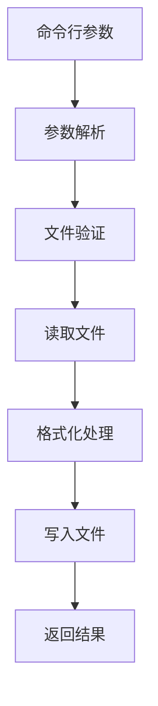
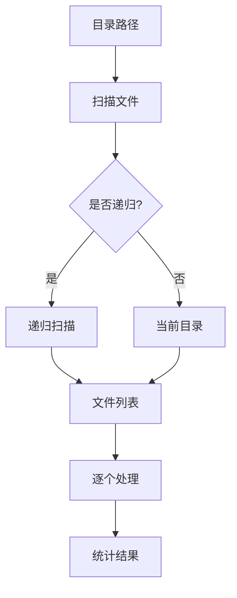

---
**文档标题**：markdown-spacer 架构概览
**文档版本**：v1.0
**创建时间**：2025-07-22
**更新时间**：2025-07-22
**维护人员**：刘凡 & 小克
**文档状态**：已完成
---

# markdown-spacer 架构概览

## 1. 设计目标

### 1.1 核心原则

- **简单实用**：专注核心功能，避免过度设计
- **易于维护**：清晰的模块边界，便于理解和修改
- **可扩展性**：支持未来功能扩展，但不为扩展而扩展
- **高质量**：通过测试和文档确保代码质量

### 1.2 技术约束

- **Python 3.12+**：现代 Python 特性支持
- **命令行工具**：简单易用的交互方式
- **正则表达式**：高效的文本处理
- **类型注解**：提高代码可读性和安全性

## 2. 整体架构

### 2.1 分层设计

```text
┌─────────────────────────────────────┐
│              CLI 层                 │
│  ┌─────────────────────────────────┐ │
│  │        cli/parser.py           │ │
│  │     命令行参数解析              │ │
│  └─────────────────────────────────┘ │
└─────────────────────────────────────┘
                    │
                    ▼
┌─────────────────────────────────────┐
│             核心业务层               │
│  ┌─────────────────────────────────┐ │
│  │      core/formatter.py         │ │
│  │      格式化核心算法             │ │
│  └─────────────────────────────────┘ │
│  ┌─────────────────────────────────┐ │
│  │    core/file_handler.py        │ │
│  │      文件处理逻辑               │ │
│  └─────────────────────────────────┘ │
└─────────────────────────────────────┘
                    │
                    ▼
┌─────────────────────────────────────┐
│             工具支持层               │
│  ┌─────────────────────────────────┐ │
│  │      utils/logger.py           │ │
│  │        日志工具                 │ │
│  └─────────────────────────────────┘ │
│  ┌─────────────────────────────────┐ │
│  │    utils/exceptions.py         │ │
│  │       异常定义                  │ │
│  └─────────────────────────────────┘ │
└─────────────────────────────────────┘
```

### 2.2 模块职责

| 模块 | 职责 | 依赖关系 |
|------|------|----------|
| `cli/parser.py` | 命令行参数解析 | 无 |
| `core/formatter.py` | 格式化核心算法 | 无 |
| `core/file_handler.py` | 文件读写处理 | `formatter.py` |
| `utils/logger.py` | 日志记录 | 无 |
| `utils/exceptions.py` | 异常定义 | 无 |
| `markdown_spacer.py` | 主程序协调 | 所有模块 |

## 3. 核心设计模式

### 3.1 依赖注入（适度使用）

```python
# FileHandler 接受 MarkdownFormatter 作为依赖
def process_single_file(self, formatter=None):
    if formatter is None:
        formatter = MarkdownFormatter()  # 默认创建
    formatted_content = formatter.format_content(content)
```

**使用原因：**

- 解耦文件处理和格式化逻辑
- 便于单元测试（可以注入 mock 对象）
- 支持不同的格式化策略

### 3.2 策略模式（简化版本）

```python
# 使用字典映射替代复杂的策略类
patterns = {
    "chinese_english": re.compile(r"([一-龯])([a-zA-Z])"),
    "english_chinese": re.compile(r"([a-zA-Z])([一-龯])"),
    # ...
}
```

**使用原因：**

- 规则配置清晰易读
- 便于添加/修改/禁用规则
- 避免过度抽象

## 4. 数据流设计

### 4.1 单文件处理流程



### 4.2 目录处理流程



## 5. 扩展性设计

### 5.1 格式化规则扩展

```python
# 添加新规则只需在 patterns 字典中添加
patterns["new_rule"] = re.compile(r"your_pattern")
```

### 5.2 文件格式扩展

```python
# 在 FileHandler 中添加新的文件扩展名
self.markdown_extensions.add(".new_extension")
```

### 5.3 命令行参数扩展

```python
# 在 parser.py 中添加新的参数
parser.add_argument("--new-option", help="New option description")
```

## 6. 性能考虑

### 6.1 正则表达式优化

- **预编译模式**：`re.compile()` 提高性能
- **模式复用**：避免重复编译
- **贪婪匹配**：合理使用 `.*?` 和 `.*`

### 6.2 内存管理

- **流式处理**：大文件按行处理
- **及时释放**：避免内存泄漏
- **缓存策略**：适度缓存编译结果

## 7. 错误处理策略

### 7.1 分层错误处理

```text
CLI 层：用户友好的错误提示
核心层：业务逻辑错误处理
工具层：系统级错误捕获
```

### 7.2 错误恢复

- **文件错误**：跳过问题文件，继续处理其他文件
- **格式错误**：保留原内容，记录错误日志
- **系统错误**：优雅退出，提供错误信息

## 8. 测试策略

### 8.1 测试层次

- **单元测试**：各模块独立测试
- **集成测试**：模块间协作测试
- **端到端测试**：完整流程测试

### 8.2 测试覆盖

- **正常流程**：标准输入输出
- **边界条件**：空文件、大文件、特殊字符
- **错误情况**：文件不存在、权限错误、格式错误

## 9. 版本历史

### v1.0 (2025-07-22)

- 初始架构设计
- 基础模块划分
- 核心功能实现
